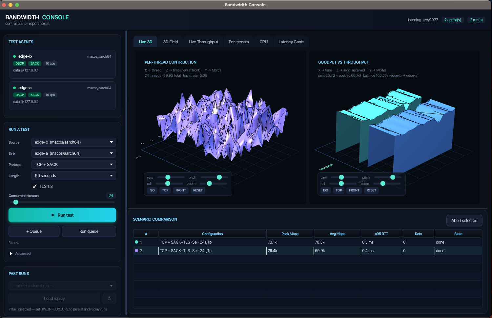
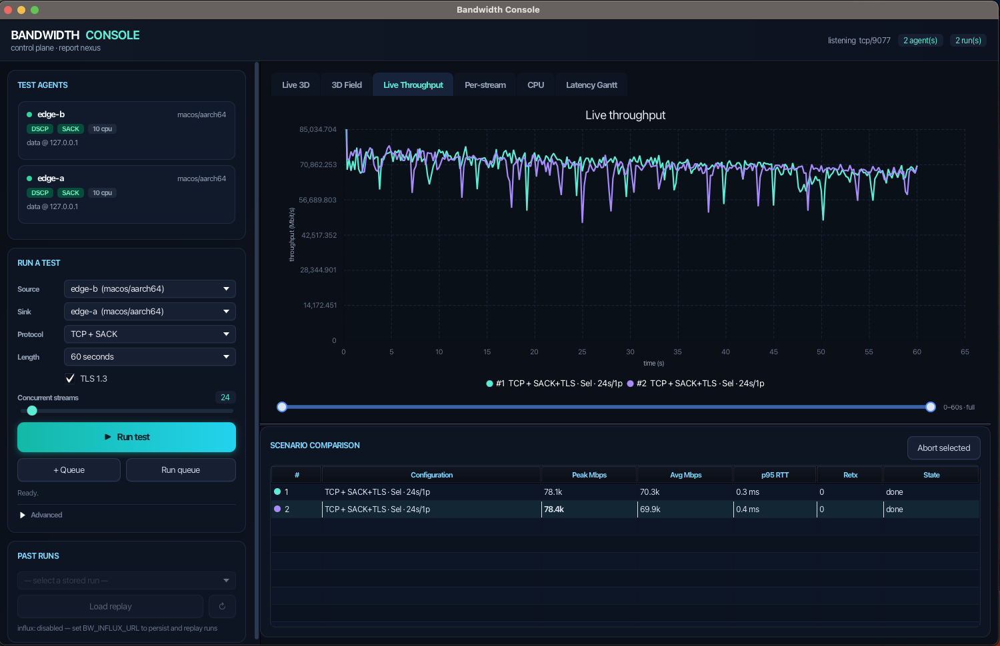
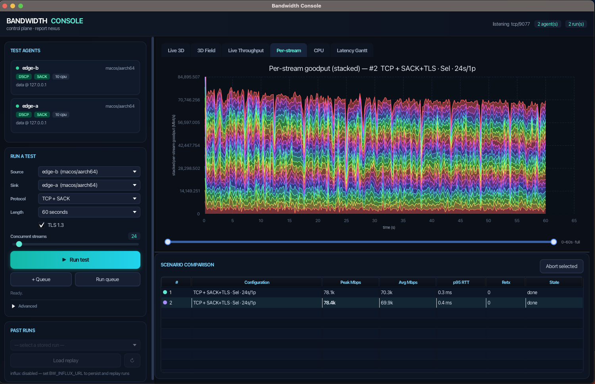
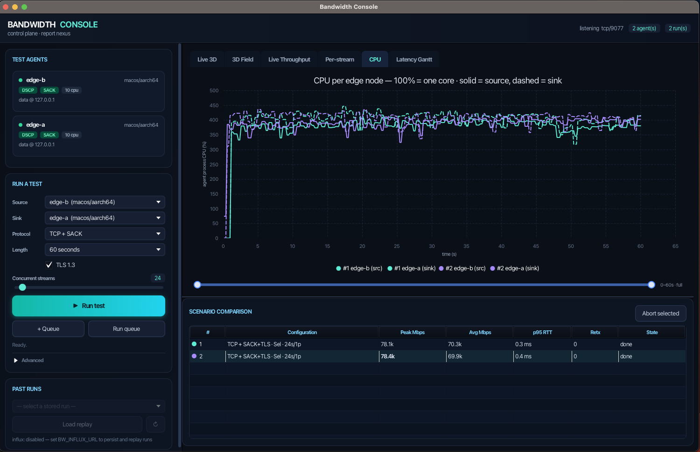
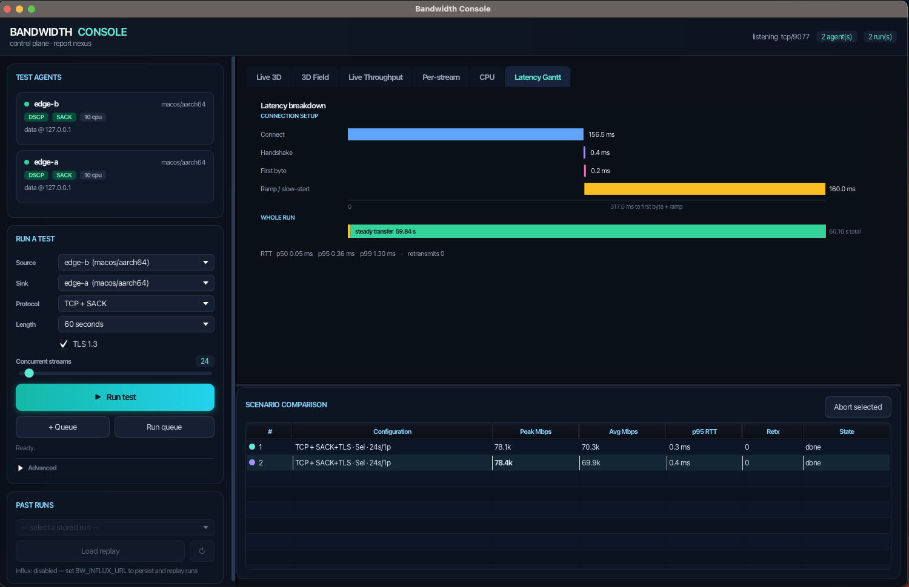

# Bandwidth Console



A distributed bandwidth-testing tool that replaces `frametest`. It has two parts:

| Component | Language | Role |
|-----------|----------|------|
| **`bwagent`** | Rust | The *test surface*. One binary, one kind of agent — there is no sender build and no receiver build. Any agent can send to any other, and can be on the sending side of one run and the receiving side of another at the same time. Deploy it in many locations. |
| **Bandwidth Console** | JavaFX | The *control plane and report nexus*. Orchestrates runs across all agents and visualises the results (3D field, live throughput, latency Gantt, scenario comparison). |

The console never carries test traffic. It tells two agents to run a test **directly between themselves** and streams back only telemetry.

```
        ┌────────────────────────────┐
        │     Bandwidth Console      │   control plane (JavaFX)
        │ 3D field · Gantt · compare │
        └───────▲────────────▲───────┘
                │            │           control (NDJSON/TCP :9077)
        ┌───────┴──────┐   ┌─┴────────────┐
        │   bwagent A  │◀─▶│   bwagent B  │   data plane, agent-to-agent
        └──────────────┘   └──────────────┘
```

The data-plane arrow points both ways on purpose. A and B are the same binary
with the same capabilities; picking **From** and **To** in the console is what
gives a *particular run* a direction. Reverse them and press Run again and the
traffic goes the other way, with no redeployment and nothing reconfigured.

## What the sliders do

Every control maps to real behaviour in the agent's data plane:

| Control | Effect |
|---|---|
| **Protocol** | TCP · TCP+SACK · UDP · UDP+DPDK · **QUIC (TLS 1.3)** · **QUIC+DPDK**. |
| **TLS 1.3** | Encrypts the TCP/SACK path with rustls. QUIC is always encrypted; the toggle greys out elsewhere. |
| **Concurrent streams** | Blast workers: OS threads (Threaded), async tasks (Selector), or QUIC streams. |
| **Concurrent processes** | Real OS-process fan-out: the sender spawns N `bwagent worker` children and aggregates their throughput. |
| **Architecture** | **Threaded** = one blocking OS thread per connection · **Selector** = one async reactor (epoll/kqueue) multiplexing all connections. The fork the tool exists to measure. Greyed out for QUIC, which is always async. |
| **Single connection** | QUIC only: multiplex all streams on one connection vs one connection per stream. |
| **Sending** | **Large file** = one continuous stream (the default) · **Multi-file** = thousands of discrete frame files, DVS `frametest` semantics end to end. See below. |
| **Run length** | Duration in seconds, **a payload size to transfer** (1 MB → 10 GB), or **continuous** until stopped. (Multi-file runs are bounded by their frame count instead.) |
| **DSCP** | Sets `IP_TOS = DSCP << 2` on the sockets (best-effort; may be re-marked by intermediate hops). |
| **Offered rate (UDP)** | Token-bucket pacing per stream; 0 = unthrottled. |
| **Fan out** | Run the same scenario on several agents at once: **N senders → 1 receiver** (incast — can one server feed six edit bays?) or **N independent pairs** (does it scale when nothing is shared?). |

Measured and reported per run: delivered goodput (aggregate **and per-stream**), sender **process CPU%**, packet loss / retransmits, RTT (p50/p95/p99) from a dedicated probe channel (or quinn's path estimate for QUIC), and a six-phase latency breakdown (connect → handshake → first-byte → ramp → steady → teardown) drawn as a Gantt waterfall.

## Multi-file mode — `frametest`, end to end

Real media workloads aren't one big stream; they're thousands of frame files, each
paying open/read/write/close on top of the wire cost. **Multi-file** answers the
question that follows: *how much bandwidth do you actually keep?*

Flip **Sending** to `Multi-file (frames)` and re-run the same scenario. On loopback
the difference is stark:

| Sending | Throughput | Per-frame |
|---|---|---|
| Large file | 86,257 Mbps | — |
| Multi-file, Memory | 7,777 Mbps | 0.73 ms wire, 0.00 ms disk |
| Multi-file, Disk | 7,800 Mbps | 1.38 ms disk, 0.33 ms wire |

**Frame storage** is the second half of the diagnosis. *Disk* reads and writes real
files at both ends (faithful to frametest, measures storage + network together);
*Memory* synthesises frames in RAM and discards them at the receiver, isolating the pure
network cost. Run both — if the Gantt's I/O band collapses in Memory mode but
throughput barely moves, your disks were never the problem.

### The staging step — frames are created before the run starts

A **Disk**-storage write run does not create frames as it sends them. It
materialises the entire set on the sender's disk first, in index order, and only
then starts moving it. This is deliberate: creating a frame inside the send loop
folds file-creation cost into every frame's measured transfer time, so a slow
disk reads as a slow network. Staging separates the two — creation is its own
phase, and what follows measures read-plus-transmit against files that already
exist. Staging time is reported in the `Generate` lane but **excluded** from the
run's throughput figures.

**Budget the disk space before you run.** The frame set is written in full, and
the default scenario is not small:

| Frame size | Per file | × 1800 frames (the default) |
|---|---:|---:|
| `sd` | 1,449,984 B | 2.6 GB |
| `hd` | 8,359,936 B | 15.0 GB |
| `2k` | 12,812,288 B | 23.1 GB |
| `4k` | 51,052,544 B | **91.9 GB** |

(Decimal GB, matching what `df` reports on Linux. Every file is the payload plus
a 64 KB header, and every size is 4096-aligned for direct I/O.)

So the out-of-the-box **4K × 1800 frames on Disk** stages ~92 GB into the frame
directory before the first byte goes on the wire. On a slow volume that phase can
run for minutes — it streams progress into the `Generate` lane the whole time, so
a console that appears to be sitting still during a multi-file run is usually
staging, not stuck. Lower the frame count or pick a smaller preset if you just
want a quick comparison.

Staging is skipped entirely when it isn't needed:

- **Memory** storage — frames are synthesised in RAM, nothing touches the disk.
- **Read** mode (`-r`, frametest's own default) — the files are expected to exist
  already; point it at a set you staged earlier and it is reused as-is.
- **Empty** mode (`-e`) — zero-length frames, so there is nothing to write.
- A set already staged by an earlier run against the same plan.

The frame directory is **not** cleaned up afterwards, which is what makes the
read-mode reuse above possible — delete it yourself when you're done with it.

The **Latency Gantt** gains a `PER FRAME` band splitting each frame into
`sender disk → network → receiver disk`, with a plain verdict underneath
(*"89% of each frame is filesystem I/O — storage-bound"*). The new **Frame I/O**
tab adds the frame-rate-against-deadline chart (shaded red wherever the run fell
short of its target fps), frametest's 13-bucket completion-time histogram, and the
open/transfer/close breakdown with min/avg/max.

**Dropped frames** are what make this a playback test rather than just "lots of
small writes". Frames are paced against the `-f` deadline through a queue of depth
`-q`; a frame that comes due while the queue is full is *dropped*, not delayed, and
excluded from the transferred count — which is why a real frametest run of 1800
frames reports 1796.

**Multi-file needs a reliable transport.** A frame either arrives whole or it did
not arrive, so the UDP paths refuse it with a clear message rather than counting
torn frames. TCP, TCP+SACK and both QUIC variants all work; QUIC maps one frame to
one stream, which is the case its multiplexing was designed for.

### `bwagent frametest` — drop-in CLI

Existing frametest command lines run verbatim, with the original report format:

```bash
bwagent frametest -w 4k -n 3000 -t 4 /mnt/san/TEST
bwagent frametest -r 4k -n 3000 -q 10 -b 5 -f 24 -t 4 /mnt/san/TEST
bwagent frametest -w 1 -z 40000 -n 3000 -t 4 /mnt/san/TEST   # custom size
bwagent frametest -e -n 3000 -t 4 -z 4 /mnt/san/TEST         # metadata/IOPS only
```

Full flag parity, including the ones that are easy to misremember — **`-o` is
out-of-order I/O completion, not an output file** (CSV is `-x`), **`-v` is reverse
order, not verbose** (`--verbose`), and **`-h` is the histogram window, not help**
(the original prints help when given no arguments, and so does this). Attached
forms parse too: `-w12512 -n1800`.

Frame-size presets are full-aperture DPX at 4 bytes/pixel plus a 64 KB header.
`2k` (12,812,288 B) and `4k` (51,052,544 B) are verified byte-exact against the DVS
reference output and the `tframetest` clone. **`sd` and `hd` are inferred** — no
source documents the original's values — and the console says so next to the
control.

Direct I/O (`O_DIRECT` / `F_NOCACHE` / `FILE_FLAG_NO_BUFFERING`) is the default,
inferred from every preset size being an exact 4096 multiple; the original's
buffering mode is undocumented, so `--buffered` is provided to compare.

### Views
**Live 3D** (two real-time 3D graphs: **per-thread contribution** — how much bandwidth each thread is generating, and **goodput vs throughput** — sent-vs-received bars showing whether the receiver keeps up with the sender; both ends of a run stream telemetry, tagged `sender`/`receiver`) · **3D Field** (throughput across the streams × processes space) · **Live Throughput** (all runs overlaid) · **Per-stream** (each stream individually — uneven lines expose unfair scheduling the aggregate hides) · **CPU** (where TLS and userspace QUIC cost shows up) · **Latency Gantt** (with the per-frame I/O band) · **Frame I/O** (frame rate vs deadline, completion-time histogram, open/transfer/close split) · **Scenario Comparison** table (fps, frames, drops and worst-frame columns alongside throughput).

**Live Throughput** — every run overlaid on one time axis for direct comparison:



**Per-stream** — each stream's goodput stacked individually; uneven bands expose unfair scheduling the aggregate hides:



**CPU** — sender (solid) and receiver (dashed) process CPU per run; this is where TLS and userspace QUIC cost shows up:



**Latency Gantt** — the six-phase breakdown (connect → handshake → first-byte → ramp → steady → teardown) with RTT percentiles:



### Capability gating
Each agent probes its host at startup and reports capabilities (`dpdk`, `dscp`, `sack`, cpu count). The console **greys out** controls the *selected sender+receiver pair* can't honour — e.g. UDP+DPDK is unavailable unless both agents report DPDK, so you can't launch an impossible scenario.

## Protocols and honesty about DPDK

- **TCP / TCP+SACK / UDP** are fully implemented and verified. UDP uses lightweight receiver feedback so it reports *delivered* throughput and real loss, not just offered load. SACK is a kernel attribute (`net.ipv4.tcp_sack`); the agent reports whether it is actually active rather than pretending to toggle it per-socket.
- **QUIC** is fully implemented via quinn: TLS 1.3, real streams, quinn's own path-RTT estimate, and a choice of multiplexing all streams on one connection or one connection per stream.

### The two DPDK datapaths

**UDP+DPDK** blasts datagrams straight over a poll-mode driver. **QUIC+DPDK** runs the *same* quinn QUIC stack — TLS 1.3, streams, loss recovery — but swaps its kernel UDP transport for DPDK. quinn abstracts that transport behind its `AsyncUdpSocket` trait, so [`DpdkUdpSocket`](agent/src/engine/dpdk.rs) is the entire integration point: implement it and QUIC runs kernel-bypass unchanged.

Both are **Linux-only** and gated behind the `dpdk` cargo feature. The datapath is fully implemented:

| Piece | Where |
|---|---|
| EAL init, mbuf pool, port/queue setup, `rte_eth_rx_burst`/`tx_burst` | [`agent/dpdk/shim.c`](agent/dpdk/shim.c) |
| Userspace Ethernet + IPv4 (real header checksum) + UDP framing, rx demux, poll thread | [`agent/src/dpdkrt.rs`](agent/src/dpdkrt.rs) |
| `DpdkUdpSocket` (quinn's `AsyncUdpSocket`) + raw UDP engine | [`agent/src/engine/dpdk.rs`](agent/src/engine/dpdk.rs) |
| Compiling the shim, linking libdpdk | [`agent/build.rs`](agent/build.rs) |

A **C shim is mandatory, not a shortcut**: DPDK's hot path (`rte_eth_rx_burst`, `rte_pktmbuf_alloc`, …) is `static inline` in the headers, so those symbols exist in no library and cannot be called from Rust FFI. Each one has to be wrapped in a real linkable function.

Because DPDK delivers raw Ethernet frames, the agent carries its own L2/L3/L4. Two simplifications, both honest for a point-to-point bench link: frames go to the **broadcast MAC** (no ARP needed — the link has exactly one other end and the port is promiscuous), and the **UDP checksum is 0** (explicitly legal for IPv4). The **IPv4 header checksum is computed properly** and unit-tested.

#### Running it without a NIC

You do **not** need hugepages, a spare NIC, or vfio binding. DPDK's `net_memif` shared-memory PMD gives a real DPDK-to-DPDK link between two containers:

```bash
podman build -t bwagent-dpdk -f agent/Dockerfile.dpdk agent
agent/tests/dpdk-test.sh QuicDpdk     # or UdpDpdk
```

or via compose: `docker compose --profile dpdk up --build`. One agent is the memif server, the other the client, sharing the socket through a volume; EAL runs with `--no-huge`. Each agent gets its own IP on the DPDK link (`--dpdk-ip`), and for DPDK runs the receiver advertises *that* address rather than its control-plane one.

#### Jumbo frames

The DPDK link runs a **9000-byte MTU**, not the 1500 default — on a point-to-point bench link there is no reason to pay per-packet overhead six times over. Three things have to agree, or frames get silently truncated:

| Setting | Where |
|---|---|
| `rxmode.mtu = 9000`, clamped to the PMD's `max_mtu` | [`agent/dpdk/shim.c`](agent/dpdk/shim.c) |
| Mbufs sized to hold a whole jumbo frame in **one segment** (no chaining) | [`agent/dpdk/shim.c`](agent/dpdk/shim.c) |
| `MAX_FRAME` / `MAX_PAYLOAD` | [`agent/src/dpdkrt.rs`](agent/src/dpdkrt.rs) |
| memif `bsize=16384` on both vdevs | [`docker-compose.yml`](docker-compose.yml) |

The clamp matters: a PMD that cannot do 9000 gets its own maximum rather than a failed `rte_eth_dev_configure()`, so the agent still starts.

Where DPDK genuinely isn't available, both protocols **fail loudly** with the specific reason ("Linux-only" vs "built without the `dpdk` feature" vs "not configured"), and the console greys them out unless *both* agents report the capability. No fabricated DPDK numbers ever reach a graph.

#### Measured over the memif link (aarch64, 2 streams, 5 s)

| Protocol | Avg | Peak | p50 RTT |
|---|---|---|---|
| UDP+DPDK | 6.9 Gbps | 11.6 Gbps | 1.95 ms |
| QUIC+DPDK | 8.4 Gbps | 9.4 Gbps | 0.27 ms |
| QUIC over kernel UDP (for comparison) | ~2.9 Gbps | — | — |

The ~3× gap between QUIC-over-kernel and QUIC-over-DPDK is the kernel-bypass win,
and it is exactly the kind of question this tool exists to answer. (memif is a
shared-memory link, so absolute numbers reflect this host, not a NIC.)

#### Gotchas worth knowing

- **`socket-abstract=no` is mandatory across containers.** memif defaults to an
  *abstract* unix socket, which lives in the network namespace rather than the
  filesystem — no file appears on the shared volume and two containers can never
  rendezvous. The server looks healthy while the client logs
  `memif_connect_client(): Failed to connect socket`.
- **A stale `memif.sock` blocks startup** with `Address already in use`; the test
  script removes it before each run.
- **EAL initialises once per process.** The agent brings the datapath up eagerly
  at startup *and* lazily per run, so bring-up is behind a mutex — otherwise the
  losing thread's `rte_eal_init` returns -2.
- **Process CPU on Linux is read from `/proc/self/stat`,** not sysinfo, which
  reported a flat 0% inside containers. macOS still uses sysinfo.

## Build & run

### Prerequisites
- Rust (stable) and Cargo — for the agent.
- JDK 21+ with `jpackage` and `jdeps`, and Maven — for the console. `mvn javafx:run` fetches JavaFX automatically. (`configure` warns below 21; the packaging targets need `jdeps --multi-release 21`.)

### The build system

Two language toolchains, one entry point. `make` does not replace Maven or Cargo
— each still owns its own build — it coordinates them and adds the GNU target
suite (`install`, `dist`, `distcheck`, `uninstall`) on top:

```
GitHub Actions ──▶ ./configure ──▶ make ──┬──▶ Maven ──▶ console  (Java)
  .github/           config.mk    Makefile └──▶ Cargo ──▶ bwagent  (Rust)
```

```bash
./configure && make && make check && sudo make install
```

**`./configure`** is hand-written, not autoconf — there is no C to probe for. It
locates both toolchains, decides which package formats this host can produce,
and writes `config.mk` for the Makefile to include. It *degrades rather than
aborts*: a box with Cargo but no JDK configures agent-only and `make` skips the
console, which is the normal case for an agent deployment host.

| Option | Effect |
|---|---|
| `--prefix=DIR` | install root (default `/usr/local`); `--bindir`, `--libdir`, `--sysconfdir`, `--with-systemdunitdir` also honoured |
| `--with-javafx-jmods=DIR` | JavaFX **jmods** (not the SDK) — required for `app-image`, `deb`, `rpm`. **Use a durable path**: this is recorded verbatim in `config.mk` and read at build time, so a `/tmp` or scratch location that gets reaped silently breaks packaging later. `configure` warns if you point it at one, and `make` refuses with a clear message rather than failing inside `jdeps`. `$HOME/.local/share/` is a good home for it. |
| `--with-java-home=DIR` | JDK to build with |
| `--enable-agent` / `--disable-agent` | force the Rust half on or off (default auto) |
| `--enable-console` / `--disable-console` | force the Java half on or off (default auto) |

**`make`** — run `make help` for the full list, which prints the detected
configuration underneath it:

| Target | Does |
|---|---|
| `all` (default) | `console` + `agent`, minus whatever configure disabled |
| `console` / `agent` | one half only — `mvn package` / `cargo build --release` |
| `check` (or `test`) | `cargo test` + `mvn test` |
| `install` / `uninstall` | install under `$(DESTDIR)$(prefix)`; `uninstall` keeps `$(sysconfdir)` |
| `installcheck` | asserts the *installed* tree runs and bundles its own JVM |
| `app-image` | jpackage image: app + jlinked JDK/JavaFX runtime |
| `deb` / `rpm` / `packages` | Linux packages — native on Linux, else via a container |
| `verify` | installs those packages into clean distro containers and checks they run |
| `dist` / `distcheck` | source tarball, then build it from scratch elsewhere |
| `clean` / `distclean` / `maintainer-clean` | escalating cleanup; `distclean` removes `config.mk` |

Two details worth knowing. `DESTDIR` is applied at install time only and never
baked into the launcher, so staged installs work. And when `cargo-zigbuild` is
present the agent is built against a pinned glibc floor (2.28) so it runs on
distros older than the build host — `make agent` then asserts the resulting
binary really does stay under that floor, because a silent fallback to a native
build is otherwise invisible until the package fails on a customer's machine.

**CI** ([`.github/workflows/ci.yml`](.github/workflows/ci.yml)) drives that same
chain rather than calling `mvn` and `cargo` directly — otherwise `configure` and
the Makefile could rot without anything noticing, and they are what someone
building from a release tarball actually uses. Four jobs:

- **build & test** on Ubuntu and macOS — `./configure`, `make help`, `make`, `make check`.
- **headless wire smoke** — a real run between two agents via
  [`mock_console.py`](agent/tests/mock_console.py), large-file and multi-file. The unit
  suites never cross the wire, so this is what catches a protocol field renamed
  on one side and not the other.
- **packages** — fetches the JavaFX jmods and `nfpm`, builds the `.deb` and
  `.rpm`, then runs `make verify` to install them into clean Debian and Rocky
  containers and check they actually start. This is the job that would have
  caught the missing `java.net.http` module and the GLIBC_2.39 dependency: both
  produced packages that built and installed perfectly and failed only on first
  run. It also asserts the missing-`nfpm` guard still fails loudly, since that
  regression is invisible by construction — it manifests as a *success*.
- **clippy & fmt** — **advisory only**, and currently failing: the agent has ~25
  clippy findings and does not match rustfmt. The job reports them so the backlog
  stays visible instead of growing silently; make it blocking once the tree is clean.

> **Status: this workflow has never executed.** It is committed code, not a
> passing pipeline — no run exists on `origin` yet. Everything it does has been
> run by hand locally (see below), but "the YAML is correct" is a claim about
> reading, not evidence. Treat the first push as the real test of it.

**Verified locally**, on macOS/arm64: `distclean` → `configure` → `make` →
`check`, `app-image`, `deb`, `rpm`, `install` + `installcheck` (staged via
`DESTDIR`), `make verify` (Debian 12 and Rocky 9, 10/10 checks each), and
`distcheck` (tarball unpacked and built clean from scratch). The Linux packages
are produced through a container, so the host does not need `nfpm`, `rpmbuild`
or `dpkg-deb`; a *native* `make deb` does, and now says so rather than quietly
shipping a console-only release — override with `ALLOW_MISSING_NFPM=1` if that
is genuinely what you want.

### Quick local demo
```bash
./run-demo.sh
```
Builds the agent, opens the console, and brings up **four nodes**:

| Node | Kind | Datapath |
|---|---|---|
| `edge-a`, `edge-b` | local host processes | kernel |
| `dpdk-a`, `dpdk-b` | Linux containers | DPDK + [jumbo frames](#jumbo-frames) |

Pick `edge-a` → `edge-b` for the kernel path, set the sliders, and hit **Run**. **Add to queue** + **Run queue** runs several scenarios back-to-back for comparison.

The two containers are linked to each other by DPDK's `net_memif` PMD and report the `dpdk` capability, so selecting `dpdk-a` → `dpdk-b` unlocks **UDP+DPDK** and **QUIC+DPDK** — greyed out on any pair that doesn't have it. The container half needs docker or podman; without either, the demo still runs the two local agents. First build takes a few minutes.

For more nodes, `docker-compose.yml` also defines three kernel-datapath containers: `docker compose up -d edge1 edge2 edge3`.

### Agent, by hand
```bash
cd agent && cargo build --release
./target/release/bwagent --console <console-host>:9077 --name edge-nyc --advertise <this-host-ip>
```
`--advertise` is the address other agents use to reach this one's data plane (its routable IP). Real DPDK build: `packaging/build-agent.sh --dpdk` (Linux).

### Console, by hand
```bash
cd console && mvn javafx:run
```

### Agents in Docker (three of them)

`docker-compose.yml` runs three containerised agents (`edge1`, `edge2`, `edge3`)
on a shared bridge network. Start the console on your host first, then:

```bash
(cd console && mvn javafx:run)     # host — binds 0.0.0.0:9077
docker compose up --build          # three agent containers
```

Each container dials the console via `host.docker.internal:9077`. The data plane
runs container-to-container over the `bwnet` network: every agent advertises its
**service name** (`edge1`…), so when the console pairs e.g. `edge1 → edge2`,
`edge1` connects straight to the host `edge2` over `bwnet`. Because the target is
a hostname, the agent resolves it through DNS (not a literal-IP parse).

Containers run Linux, so they report `dscp`/`sack` true and read the real
`net.ipv4.tcp_sack`; `dpdk` stays false (greyed out) unless built with the
feature on a DPDK-provisioned host. Podman works too — the image builds from the
same Dockerfile and container-name DNS resolves on a user-defined network.

Scale beyond three by copying an `edge*` service block, or point agents on other
hosts at the console's real IP with `--console <host>:9077 --advertise <this-ip>`.

## Persistence and Past Runs replay (InfluxDB)

Optional. Point the console at an InfluxDB v2 instance and every sample and run
summary is persisted; the **Past Runs** picker then reloads a stored run into the
live views so you can compare it against what's running now.

```bash
export BW_INFLUX_URL=http://localhost:8086
export BW_INFLUX_TOKEN=bwtest-token
export BW_INFLUX_ORG=bwtest
export BW_INFLUX_BUCKET=bwtest
cd console && mvn javafx:run
```

`docker compose up influxdb` brings up a preconfigured instance with those
credentials. With `BW_INFLUX_URL` unset the client is inert and the console runs
normally — nothing else changes.

Two measurements are written: `bw_sample` (per-sample goodput/rtt/cpu, tagged by
runId/protocol/arch/sender/receiver) and `bw_run` (the summary + latency phases).
Per-stream detail is *not* persisted, so a replayed run has an empty per-stream
chart. `InfluxSmoke` round-trips the write and query paths:

```bash
java -cp target/classes:$(cat /tmp/cp.txt) com.bwtest.console.net.InfluxSmoke
```

## Packaging (multi-platform release)

`jpackage` cannot cross-compile, so each installer is built on its own OS. Linux
builds in a container; macOS and Windows need their own machines.

### Nothing is required on the target machine

Both packages are self-contained. The console **bundles its own OpenJDK 21
runtime** (jlinked, with JavaFX) at `/opt/bwconsole/lib/runtime` and never looks
for a system JVM — the packages declare no `java`/`jre`/`jdk` dependency, and
the verification below installs and runs them in containers that have no Java
installed at all. The agent is a static-ish Rust binary and needs no runtime.

Upgrading or removing the system Java on a machine therefore cannot affect the
console, and a machine with no Java can run it.

### Linux — `.deb` and `.rpm`

**Prerequisites:** Podman or Docker. Off Linux you need nothing else — no JDK,
Maven, Rust or JavaFX on the host, because the build image carries all of it and
`make` runs the build inside a container. On Linux the same targets run natively
against whatever `configure` found.

**Regenerate every Linux package, then prove it works:**

```bash
./configure --with-javafx-jmods=/path/to/javafx-jmods-23.0.1
make packages      # console + agent, .deb and .rpm
make verify        # install them into clean distro containers and check
```

`make verify` installs the results into clean `debian:12` and `rockylinux:9`
containers and asserts they install, run, carry their own JVM, and remove
cleanly. It exits non-zero if any check fails.

The containerised build configures itself into `/tmp/config.mk` rather than the
bind-mounted repo, so running `make deb` from macOS does not overwrite the
`config.mk` describing your host.

Output lands in `packaging/dist/`, four packages:

| Package | Contents |
|---|---|
| `bwconsole` | The console, a bundled JDK 21 + JavaFX runtime, and a matching `bwagent` at `/opt/bwconsole/lib/app/bwagent` |
| `bwagent` | Just the agent, at `/usr/bin/bwagent`, plus a systemd unit and `/etc/bwagent/bwagent.env` |

The agent unit ships **disabled** — `BW_CONSOLE` defaults to `127.0.0.1`, so
starting it unedited would register an agent against a console that is not
there. Edit the env file, then `systemctl enable --now bwagent`.

<details>
<summary>Running the steps individually</summary>

```bash
make deb          # console .deb via jpackage, agent .deb via nfpm
make rpm          # the same two, as .rpm
make app-image    # just the jpackage image, no installer
```

Inside the build image the same Makefile runs natively, so you can also drive it
by hand:

```bash
podman build --platform linux/arm64 -f packaging/docker/Dockerfile.linux -t bwtest-build:arm64 .
podman run --rm -v "$PWD:/src" -w /src bwtest-build:arm64 \
    sh -c './configure --with-javafx-jmods=$JAVAFX_JMODS && make packages'
```

Override `IMAGE` to name the build image, `GLIBC_FLOOR` for the agent's minimum
glibc, and `CONFIG_MK` to configure into somewhere other than `config.mk`.
</details>

#### x86_64 must be built on x86_64

`make deb` refuses to build `amd64` packages on an arm64 host, because `rustc`
segfaults under qemu-user emulation (`uncaught target signal 11`) and the image
dies partway through a long build. Use a native x86_64 Linux host or CI runner.

#### Changing versions

- **App version** — `console/pom.xml` `<version>` for the console,
  `agent/Cargo.toml` `version` for the agent. The scripts read both; nothing
  else needs editing.
- **Toolchain** — the `ARG`s at the top of `packaging/docker/Dockerfile.linux`
  pin JavaFX, nfpm, zig and Rust. They are pinned so that two builds a month
  apart produce the same toolchain; bump them deliberately.
- **Icons** — regenerate after editing `packaging/resources/GenerateIcon.java`:

  ```bash
  java packaging/resources/GenerateIcon.java packaging/resources
  iconutil -c icns packaging/resources/bwconsole.iconset -o packaging/resources/bwconsole.icns  # macOS only
  ```

#### Constraints that are load-bearing

Change these only on purpose — each one was a real failure:

- **The base image tag is pinned on both axes**: `eclipse-temurin:21-jdk-jammy`.
  The floating `:21-jdk` lands on Ubuntu 25, whose uutils `comm` breaks
  jpackage's rpm `%install`; 24.04 leaks `libpng16-16t64`-style dependency names
  that do not resolve on Debian.
- **`LC_ALL=C`** in the image, so the `sort` and `comm` in that same scriptlet
  agree on where `/` orders.
- **The agent's glibc floor is explicit** (2.28, via `cargo-zigbuild`), so it
  runs on RHEL 8/9 and Debian 10+. Built natively it demands the build image's
  glibc and will not start on RHEL 9 — including the copy inside the console
  package. `make agent` fails the build if this regresses.
- **The module list is computed by `jdeps`, never hand-written.** The original
  hand-written list omitted `java.net.http`, and the packaged app installed
  perfectly then died on startup.
- **GTK is declared manually** via `--linux-package-deps`; JavaFX `dlopen`s it,
  so jpackage's dependency scan cannot see it.

#### Reproducibility

Builds are **version-pinned, not bit-reproducible**. Every tool the image
installs is pinned to an exact version, so rebuilding gives the same toolchain
and the same behaviour. Two things still float: Ubuntu `apt` packages within
jammy, and the downloads are not checksum-verified. Add checksums if you need
supply-chain guarantees.

### macOS and Windows

`make install` and `make app-image` already work on both — the app image bundles
its own runtime everywhere, so `make install` on macOS lays down a
`bwconsole.app` under `$(libdir)` with a `bwconsole` wrapper on `$PATH`. The
`.dmg` and `.msi` installer targets are not written yet; until then use
`make app-image` and `jpackage --type dmg|msi` against it directly.

For the agent alone, `packaging/build-agent.sh` still handles cross-compiling
(`TARGET=<triple>`), which `make agent` does not.

**macOS rejects a 0.x version**, which is one reason the project starts at 1.0.0:
CFBundleVersion's first component must be `>= 1`, and jpackage has no
mac-specific version flag. Should the version ever go back below 1, the build
stops with an explanation rather than guessing, and `MACOS_APP_VERSION` overrides
just the macOS artifacts while Linux and Windows keep the project version.

Installers are unsigned, so macOS Gatekeeper and Windows SmartScreen will warn
on first launch.

## Verifying

The Rust data plane and both wire directions are covered by a headless smoke test:
```bash
cd agent
python3 tests/mock_console.py 9077 &            # stand-in console
./target/release/bwagent --console 127.0.0.1:9077 --name A &
./target/release/bwagent --console 127.0.0.1:9077 --name B &
# prints per-second telemetry and the final summary; exit 0 = healthy run
```
Set `SC_PROTO`, `SC_ARCH`, `SC_THREADS`, `SC_PROCS`, `SC_DSCP`/`SC_DSCP_EN`, `SC_RATE`, `SC_DUR` to exercise other scenarios.

**Multi-file** runs are covered by the same harness. `SC_MODE=MultiFile` switches
it on, and the smoke test then also asserts that every frame is accounted for
(transferred + dropped == requested), that the histogram totals match, and that the
Gantt's I/O split is populated:

```bash
SC_MODE=MultiFile SC_STORAGE=Disk SC_FRAME_MODE=Write \
  SC_FRAME_BYTES=1048576 SC_FRAME_COUNT=200 SC_THREADS=4 \
  SC_FRAME_PATH=/tmp/frames-a SC_DEST_PATH=/tmp/frames-dst \
  python3 tests/mock_console.py 9077
```
Also honoured: `SC_FPS`, `SC_QUEUE`, `SC_PREBUF`, `SC_ORDER`, `SC_HEADER_KB`,
`SC_DIRECT`. Use `SC_STORAGE=Memory` for the no-disk comparison.

The frame engine's own behaviour — byte-exact preset sizes, histogram bucketing,
drop accounting, filename patterns, direct-I/O alignment — and the frametest CLI's
flag grammar are unit tested: `cd agent && cargo test` (39 tests).

The **real DPDK datapath** has its own end-to-end test — two agents linked by
the `net_memif` shared-memory PMD, no NIC and no hugepages required:

```bash
podman build -t bwagent-dpdk -f agent/Dockerfile.dpdk agent
agent/tests/dpdk-test.sh UdpDpdk      # or QuicDpdk
```

The userspace framing (IPv4 checksum, roundtrip, non-UDP rejection) is unit
tested: `cd agent && cargo test`.

### Looking at the UI without running a full stack

`UiSnapshot` renders the real console with representative agents and runs seeded,
and writes a PNG per tab to `/tmp/ui-*.png`:

```bash
cd console
mvn -o dependency:build-classpath -Dmdep.outputFile=/tmp/cp.txt
CP=$(cat /tmp/cp.txt); FX=$(echo "$CP" | tr ':' '\n' | grep -E 'javafx-(base|graphics|controls)' | tr '\n' ':')
java --module-path "$FX" --add-modules javafx.controls,javafx.graphics \
     -cp "target/classes:$CP" com.bwtest.console.ui.UiSnapshot
```

Use it when changing anything visual. The layout lives in a single class
(`ConsoleUI`) precisely so the app and this harness always render the same thing.

The console's own networking/JSON layer has a JavaFX-free check in
[`HeadlessSmoke`](console/src/main/java/com/bwtest/console/net/HeadlessSmoke.java) that drives a real run using the production `ControlServer`/`AgentConnection`.

## Control protocol

NDJSON over TCP. Agents dial the console (so they work behind NAT). Messages are JSON objects tagged by `"type"`; the Rust `protocol.rs` and the Java `AgentConnection` mirror each other. Agent→console: `register`, `heartbeat`, `receiveReady`, `telemetry`, `runComplete`, `runError`, `log`. Console→agent: `prepareReceive`, `startSend`, `abort`.

## Layout
```
agent/              Rust bwagent (control client + data-plane engines + process fan-out)
agent/Dockerfile    container image for the agent
console/            JavaFX console (control server, orchestrator, UI)
packaging/          build scripts for agent binaries and console installers
docker-compose.yml  three containerised agents on a shared network
```
